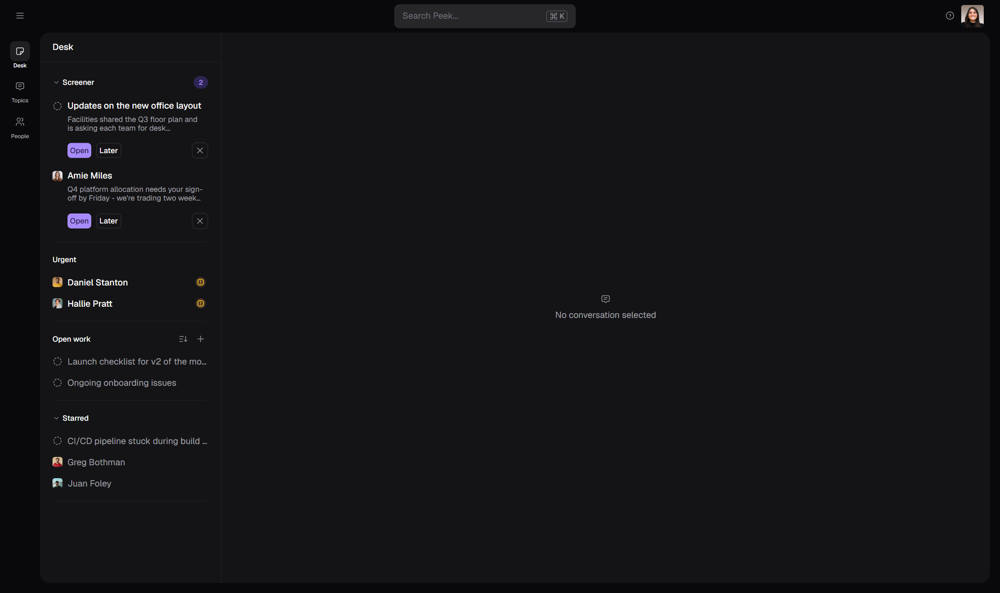
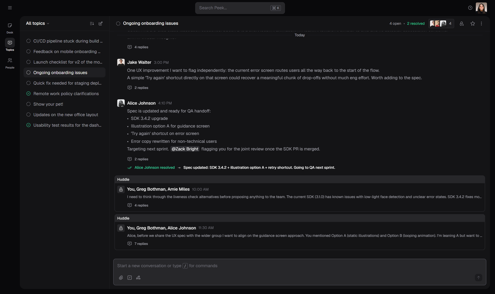
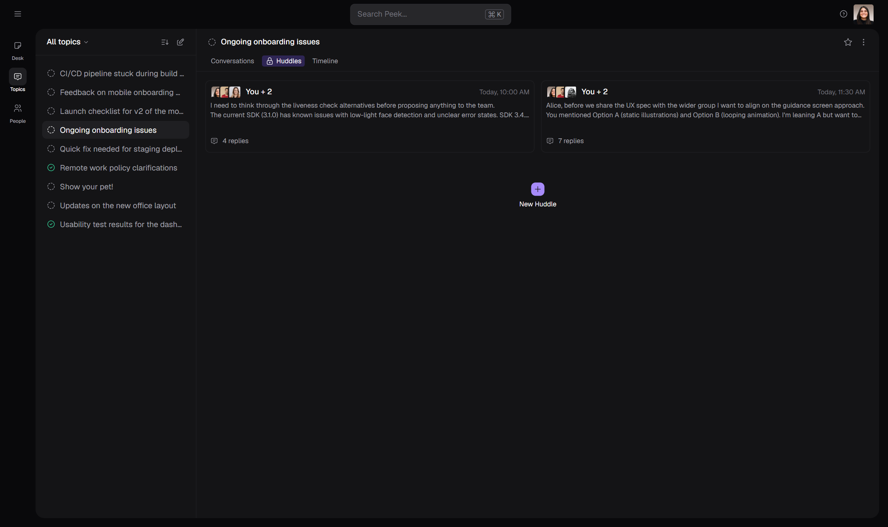
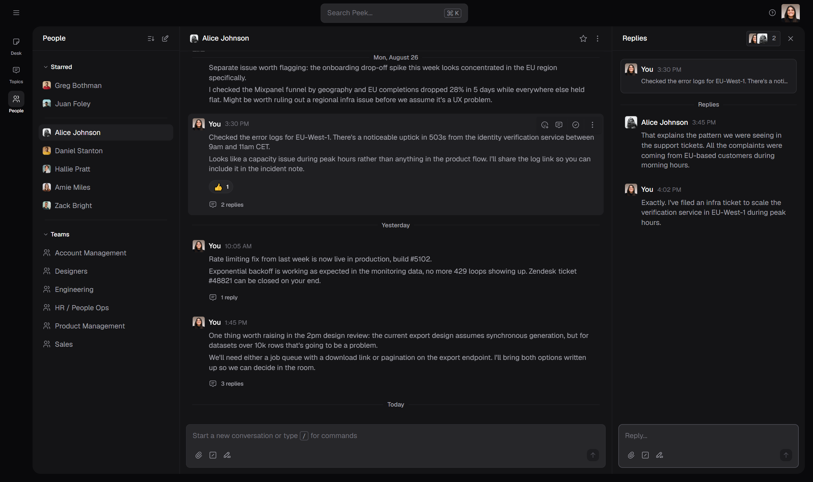
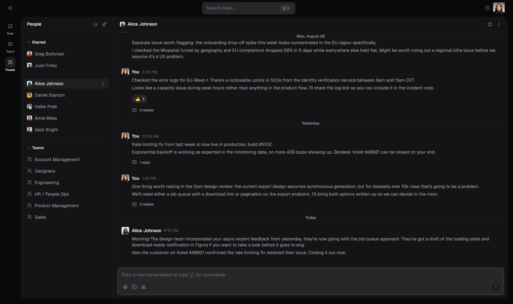
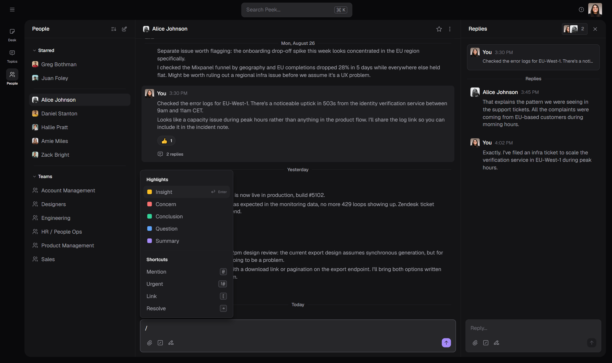
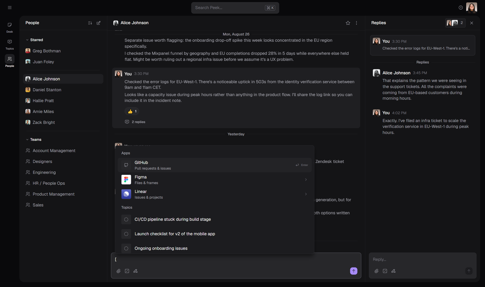

# Peek — Product Overview

*A complete, non-technical guide to what Peek is, how it works today, and where the UX can go next.*

**Who this is for:** anyone on the team — founders, design, marketing, ops, new hires. No technical background needed.

**How to read the labels:** every feature in this document carries one of three statuses, and the difference matters:

| Label | Meaning |
|---|---|
| ✅ **Built** | Works in the current prototype. You can click it today. |
| 🟡 **Designed** | Specified in detail (Linear PRDs / locked design decisions) and partially visible in the prototype, but not fully working yet. |
| 🔭 **Vision** | Described in our Linear docs as direction. Not in the prototype at all. |

> **One honest caveat:** the current app is a **design prototype** with example data. It looks and feels like a real product, but nothing is saved permanently — refreshing the browser resets everything you did. That's expected at this stage.

---

# Part 0 — TL;DR

**Peek is a work-communication app built on one belief: communication is thinking.** Where Slack turns every message into a red badge and pushes everyone into reactive reading, Peek is designed so that *you* stay in charge of your attention. Messages are organized into **Topics** (shared subjects) made of **Conversations** (threads that can be *resolved* — closed with an outcome). Your personal home is the **Desk**, where incoming messages wait quietly in a **Screener** until you decide what to do with them, truly urgent things interrupt you through a dedicated **Urgent** lane, and everything you're working on sits in **Open work** like browser tabs. **Huddles** give you a private side-space inside a topic to think with one or two people (or, later, AI) before going public. The long-term bet: communication in Peek should naturally produce *signal* — resolutions, timelines, summaries — so people can understand what happened without reading everything.

---

# Part A — What Peek is and how it works

## A1. Why Peek exists

Our mission document puts it plainly:

- **Communication is thinking.** We talk to others to learn, to test ideas, to make progress on what we care about.
- **Tools carry opinions.** The way a tool is designed tells people how to behave. Slack's design says: *react to everything, now.*
- **Peek's opinion is the opposite:** highlight signal, reduce noise, create clarity and ownership, and give people a safe space to experiment with ideas.

Three design consequences run through the whole product:

1. **Mentions don't interrupt.** In Peek, @-mentioning someone means "you should eventually read this" — it does *not* fire a notification. Only an explicit **urgent** mention interrupts. (This is the single biggest philosophical difference from Slack.)
2. **Conversations end.** Every conversation can be **resolved** — closed with an explicit outcome message. Communication produces artifacts, not just scrollback.
3. **You organize your own attention.** The Desk is *yours*: you screen what comes in, choose what's open, and star what matters long-term. Nobody else's activity rearranges your day.

On AI, the team's stance is "human-first, AI-last": AI should extend *you* (quietly improving your writing, summarizing progress) rather than being another chat partner demanding attention. See section A5.

---

## A2. The mental model — Peek's building blocks

Everything in Peek is made of a small set of concepts:

```
        TOPIC  ("Ongoing onboarding issues")           ← shared subject space, always public
        ├── Conversation 1  ── replies… ── resolved ✓
        ├── Conversation 2  ── replies…                ← each conversation is one thread
        ├── Conversation 3  ── replies…
        ├── 🔒 Huddle A  (You + Greg)                   ← private side-space inside the topic
        ├── 🔒 Huddle B  (You + Greg + Alice)
        └── Timeline  (how the topic evolved)          ← 🔭 vision

        DESK (personal)                                 PEOPLE
        ├── Screener   (incoming, waiting for triage)   ├── DMs (1:1 messages)
        ├── Urgent     (interrupts, needs response)     └── Teams
        ├── Catch-up   (🔭 scheduled review)
        ├── Open work  (your "browser tabs")
        └── Starred    (long-term bookmarks)
```

**The rules that make the model simple:**

| Rule | Status |
|---|---|
| A conversation belongs to **at most one** topic (or none — e.g. a DM). | ✅ Built |
| A topic can hold many conversations and many huddles. | ✅ Built |
| **All topics are public.** There is no "private topic." | ✅ Built (deliberate decision — see below) |
| **Huddles are the only private space**, and always live inside a topic. | ✅ Built |
| Every conversation can be **resolved** and **reopened**; a topic counts as resolved when all its conversations are. | ✅ Built |
| A topic can have one **category**; conversations can have **tags**. | 🔭 Vision |
| Meaningful progress produces **timeline entries** (AI-written summaries). | 🔭 Vision |

**Why no private topics?** Earlier designs had public/private topics, but that creates the classic trust problem: content written for two people getting exposed when a topic "goes public," and members never being sure who can see what. The team removed private topics entirely and replaced them with a *spatial* boundary: the topic is always public; if you need privacy, you use a **huddle** inside it. One private primitive, easy to reason about.

**The signal layer (vision).** The original idea of manually "highlighting" important messages evolved: the current direction is **timeline entries** — short, AI-written summaries of meaningful progress ("the team narrowed the bug to the identity service, fix targeted for next sprint"), grounded in a span of messages, appearing in a topic **Timeline** and later in **Catch-up**. Two principles govern them: *scarcity* (no entry is better than a weak entry) and *consolidation* (one strong summary beats five fragments). Raw private wording is never quoted into public surfaces — summaries are rewritten. The prototype still contains the earlier, manual version of highlights (see A3, Writing).

**How the concepts link together:**

- **Screener → Open work:** triage an incoming conversation into your working set.
- **DM → Topic + Huddle:** a 1:1 conversation can "grow up" into a public topic, with the original DM becoming its first private huddle (see journey J4).
- **Huddle → Topic:** a huddle's outcome is *published back* as a new public conversation in the topic — members react to the outcome without seeing the private discussion (🔭 vision; not built yet).
- **Resolution → everywhere:** resolving the last open conversation flips the topic's icon from a dashed circle to a green check *everywhere it appears* — lists, headers, Desk rows, inline references in message text, even in the composer.
- **Timeline → Catch-up:** the same summaries that explain one topic's evolution get grouped across all topics you follow into a scheduled review ritual (🔭 vision).

---

## A3. The surfaces — where you spend your time

The app has three destinations in the left navigation rail — **Desk**, **Topics**, **People** — plus a top bar (search, theme, debug switches) and a right-hand **thread panel** that opens when you enter a conversation. Two more destinations, **Views** and **Files**, are designed but switched off. ✅

The whole left side can collapse to give the conversation full width, and the app supports **Light / Dark / System** themes (switcher lives under your avatar). ✅

> 🔍 A note you'll notice while using the prototype: a small "?" button in the top bar opens a **debug menu** — a scenario switcher used for design exploration (show/hide Screener and Urgent, simulate unreads, and choose between three different Huddle designs). It's a prototyping tool, not a product feature.



### A3.1 Desk — your personal home ✅ / 🟡 / 🔭

The Desk is the answer to "what should I do right now?". Left panel, top to bottom:

| Section | What it is | Status |
|---|---|---|
| **Screener** | Incoming conversations where you were mentioned, waiting for *your* decision. | 🟡 Designed, partially built |
| **Urgent** | Conversations someone marked urgent *for you*. They skip the Screener and interrupt. | ✅ Built (receiving side) |
| **Catch-up** | A scheduled review of topics you follow. | 🔭 Vision — not in the app |
| **Open work** | The things you're working on now — works like browser tabs. | 🟡 Designed, partially built |
| **Starred** | Long-term bookmarks (people and topics). | ✅ Built |

Clicking any item opens it **inline on the right side of the Desk** — you never lose your place. ✅

**Screener in detail.** The philosophy: *"You should be in charge of your focus. Not others."* New conversations that mention you don't shout — they queue. Each Screener card shows who/what it is (a topic icon or the sender's photo), the title, and a two-line preview — enough to decide without opening it. If nothing's incoming, the Screener disappears entirely: silence means silence.

Each item offers three choices:

| Action | Meaning | Status |
|---|---|---|
| **Open** | "I'll deal with this now" → adds it to Open work | 🟡 button exists, not yet wired |
| **Later** | "Ask me again in 15 min / 1 h / 3 h / tomorrow" | 🟡 button exists; the timing picker is designed, not built |
| **✕ Dismiss** | "Not for my Desk" — it stays readable in normal browsing, just never nags again | ✅ works |

**Urgent in detail.** When someone writes `!@you`, the conversation lands in the Urgent section at the top of your Desk with an amber alert badge — bypassing the Screener. Urgency is *per person*: `!@Adam !@Bob @Cathy` is urgent for Adam and Bob, a normal mention for Cathy. And it's *one-time*: once you've seen and answered, new replies don't re-trigger urgency unless someone urgent-mentions you again. The design also covers escalating an already-sent message by editing a `!` into the mention. (Receiving side ✅ built with example data; the full send-to-receive loop is 🟡 — see "gaps" below.)

**Open work in detail.** The metaphor is deliberate: browser tabs for work. Anything can be opened — conversations, topics, later also views and files. A tab *remembers where you were*: browse deep inside a topic, switch away, come back — you continue exactly there (that's what distinguishes it from Starred). Close the tab when you're done. In the prototype: topic rows with a working "remove" button ✅; adding new items and tab-state memory are 🟡.

**Starred in detail.** Bookmarks for the long term: the people you talk to daily, the topic you check every morning. Unlike Open work, a starred item always takes you to the same fixed place. Star/unstar from any conversation header (the star fills in amber). Starred items show an unread dot when something new happened. ✅

### A3.2 Topics — the shared brain ✅



The Topics page is a two-panel view: an alphabetical topic list on the left (each row carrying its live status icon — dashed circle = open, green check = fully resolved), and the selected topic on the right.

**The topic header tells you the state of the subject at a glance:** status icon + title, "4 open · 2 resolved" counts (resolved in green), a members pill showing overlapping avatars + total count (everyone invited or participating), a "start a huddle" lock button (in the huddle layouts without tabs), a star, and a more menu. ✅ *(The star works; the header's own "more" menu is still decorative.)*

**Inside a topic** you see date-grouped conversation cards. Each card is one thread: author, time, message, reactions, reply count. Clicking a card opens its thread panel. A composer at the bottom starts a new conversation in the topic.

**Three competing designs for where huddles live.** This is an active design exploration — the prototype ships all three, switchable in the debug menu:

| Variant | How huddles appear | Trade-off |
|---|---|---|
| **Tabs** | The topic gets three tabs: *Conversations / 🔒 Huddles / Timeline*. Huddles live in a card grid under their own tab, with a "+ New Huddle" tile. | Clean separation, but huddles are out of sight, out of mind. |
| **Tree** | Huddles appear as branch rows *under the topic in the left sidebar*; selecting one opens it as its own full view. | Huddles feel like real places; costs sidebar space and a navigation level. |
| **Inline** *(current default)* | Huddle cards appear *inside the conversation stream*, chronologically, with a grey "Huddle" banner and a lock avatar. | Maximum visibility of "side-thinking happening here"; stream mixes two privacy levels visually. |



**Timeline tab** (in the Tabs variant) is a placeholder today: *"A selective view of how this topic evolved — highlights, resolutions, and key events."* The real thing is specified in depth (see A5). 🔭

### A3.3 Conversations, cards, and every state they can be in ✅

The conversation card is the atom of Peek. A product person should know its states precisely, so here they are:

**Card backgrounds & borders**

| Situation | What you see |
|---|---|
| Resting | Flat card on the surface, no border |
| Hovered | Slightly lifted background, subtle border, and a **quick-action toolbar** appears top-right |
| Selected (its thread is open) | Highlighted background |
| Being edited | Highlighted background with a blue accent border around the editor |
| Has something new (unread) | Soft **blue** border + a blue dot next to the author's name |
| Has something new **and urgent** | Soft **amber** border + an amber alert badge instead of the dot |

**Anatomy, top to bottom**

1. **Author line:** avatar, name, time. If the message is a Highlight, a small colored pill sits here naming the type (Insight = amber, Concern = red, Conclusion = green, Question = blue, Summary = purple).
2. **Body:** paragraphs, bullet/numbered lists, plus inline "chips": `@mentions` (neutral pill), `!@urgent mentions` (amber pill), `[Topic]` references (pill with the topic's **live** status icon — it flips to a green check the moment that topic is resolved, wherever the reference appears), `[File]` references (pill with the app's icon — Figma, Linear, GitHub, documents).
3. **Reactions row:** emoji pills; yours is tinted purple, others neutral. Five quick emoji are offered (👍 💯 🙏 🚀 🎉).
4. **Replies row:** "N replies" — plus a blue "1 new" chip when there are unread replies (amber if urgent).
5. **Resolution banner** (only when resolved): green double-check, "*Alice resolved*", and — if provided — an arrow and the resolution message: *"→ Spec updated: SDK 3.4.2 + retry shortcut. Going to QA next sprint."*

**A promoted message wears an anchor.** If a DM message was used to start a topic, the card gains a header line above it: a status circle and "**Huddle in** *Topic title*" — the title links to the topic. ✅

**The hover toolbar** offers: React, Reply, Resolve (or Reopen when already resolved), and More. The **More menu** adapts to context: *Start topic* (only in DMs, only on messages that haven't already seeded one), *Resolve/Reopen*, *Open work*, *Mark as Highlight* (submenu with the five types), *Edit message* (only your own), *View details*, *Delete* (only your own, in red). ✅ — with two caveats: "Open work" and "View details" are visual stubs today. 🟡

**Editing is powerful.** Enter edit mode and the message body comes back into a full editor — including its highlight tag and, crucially, its **resolution**: the resolution line appears as an editable block; change the wording and save, or delete the block and the conversation *reopens*. Editing is the canonical way to fix or undo a resolution. ✅

**The thread panel** (right column) is where a conversation's replies live: the original message pinned at top (compact), a divider, the replies, and a reply composer. Replies are full citizens — they can be reacted to, highlighted, edited, deleted, and a reply can *carry the resolution* of its parent ("→ fixed in build 5102" resolves the conversation and marks that reply as the one that closed it). For huddle threads the panel adds: a lock icon, the huddle's member pill, an "Open original" button (jumps back to the source DM), and — for promoted DMs — a "**Promoted to _topic_ · date**" divider that splits replies into before/after the promotion. ✅



**Resolution reaches everywhere.** This is the most connected behavior in the app. There are *seven* ways to resolve/reopen (hover toolbar, more menu, typing `→` in a reply, typing `→` while composing, editing a message's resolution block in or out, and the dialog with or without a message). And when a topic's last conversation resolves, the green check appears simultaneously in: the card, the topic header and its counts, the topic list row, all three Desk sections, the "Huddle in…" anchor, the "Promoted to…" divider, every inline `[Topic]` chip in any message, and the reference menus in the composer. One truth, every surface. ✅

### A3.4 People — DMs and teams ✅

A directory-style page: **Starred** people pinned on top, then your DMs (unread first when there are unreads), then **Teams** (listed, not yet openable). Selecting a person opens the 1:1 conversation — same cards, same threads, same composer as topics. DMs are also where "Start topic" lives (see journey J4). ✅



### A3.5 The writing experience — the composer ✅

Writing is "the heart of Peek," and the composer is the most finished part of the prototype. The idea (from the Shortcuts spec): you should be able to do everything — address people, escalate, reference things, close conversations, label signal — *without leaving the keyboard or breaking your writing flow*. Peek recognizes lightweight writing patterns and turns them into structure, always with visible feedback.

| You type | What happens | Status |
|---|---|---|
| `@` | People menu opens (photo, name, role; arrow keys + Enter). Inserts a purple mention chip. Recipient sees it in their Screener — no notification. | ✅ |
| `!@` | Same menu, but titled "Urgent mention" — inserts an **amber** chip and the whole composer grows a thick left bar: *you are writing something urgent*. | ✅ (see gap below) |
| `[` | A two-level reference menu: **Apps** (GitHub / Figma / Linear → drill into their files), **Topics** (with live status icons), **Documents**. Type to search across all of them flatly. Inserts a reference chip. | ✅ |
| `/` | Command menu with two groups: the five **Highlight** labels and shortcuts to the other patterns (@, !@, [, →). | ✅ |
| `-> ` | The line turns into a **resolution block** (bordered, `→` prefix). On send, the conversation resolves with that text as its outcome. Typing just `-> done` (or `-> resolved`, or nothing) resolves without a message. | ✅ |
| `- ` / `1. ` | Bullet / numbered list. Enter continues the list, Shift+Enter splits, Enter on an empty item exits. | ✅ |




**Enter sends. Shift+Enter makes a new line.** If any suggestion menu is open, Enter picks the selection instead of sending — a small detail that makes the flow feel right. ✅

**Highlights while composing:** picking a label from the `/` menu (or the highlighter icon in the toolbar) pins a colored tag — e.g. 🟨 *Insight* — to the front of your draft, and the composer shows the same left-bar emphasis as urgent. The label ships with the message and appears as the pill on the card. Note: the Linear spec describes triggering these with leading emoji (💡⚠️✅❓📝); the prototype uses the `/` menu and toolbar instead — same concept, different trigger. Also note the team's more recent locked decision leans toward *cutting* manual highlights in MVP in favor of the AI timeline (see A5) — this is an open product question. ✅ built / 🟡 direction under discussion

**Known gap worth naming (found while testing):** composing an urgent `!@` mention styles the message correctly, but in the prototype it doesn't yet *flag the conversation as urgent* on the receiver's Desk — the Urgent section currently runs on example data. The visual language is built; the plumbing from send → receive is not. 🟡

**Decorative for now:** the attach-file and snooze icons in the composer toolbar, and the big search field in the top bar (⌘K), are visual placeholders. 🟡

### A3.6 Huddles — private thinking space ✅ (three prototypes)

A huddle is a small private room *inside* a public topic: its own members (always including you), its own thread, a lock everywhere it appears. Created either from a topic ("Start a huddle" → type names → write the first message — the recipient picker and composer appear inline), or automatically when a DM is promoted into a topic. Huddle cards show members, a preview of the latest thinking, and a **live reply count** that ticks up the moment anyone replies in the thread. Delete works; "view details" is a stub. ✅

What's *not* built yet is the huddles' most important vision behavior: **publishing back** — turning the huddle's outcome into a new public conversation in the topic (so the group sees the conclusion, never the raw exploration). Today a huddle's insight leaves the huddle only by someone re-typing it. 🔭

---

## A4. The core journeys — how a day in Peek flows

**J1 — Morning triage.** ✅/🟡 You open Peek on the Desk. The Screener shows "2 new": a topic you were mentioned in and a message from Amie. You read the two-line previews without opening anything. The office-layout topic can wait — *Later* (tomorrow). Amie's sign-off request matters — *Open*, and it becomes a tab in Open work. Screener empties and disappears; your Desk is quiet again. *(The reading/preview part is built; Later/Open actions are designed but not wired.)*

**J2 — Something urgent lands.** ✅/🟡 Daniel needed you: he wrote `!@You` — so he consciously decided this can't wait. The conversation appears in the amber **Urgent** lane at the top of your Desk, above everything. You click it, it opens inline, you answer and resolve it with `-> hotfix deployed`. By design, follow-up replies won't interrupt you again unless someone marks them urgent anew. *(In the prototype the Urgent lane is populated with example data; the clearing behavior after you respond is designed, not yet wired.)*

**J3 — Working a topic to done.** ✅ In *Ongoing onboarding issues* (4 open · 2 resolved), you open a conversation's thread, and the team converges. You type `-> Spec updated: SDK 3.4.2 + retry shortcut` — the reply posts, the conversation's card gains the green resolution banner, the header now reads 3 open · 3 resolved. When the last conversation resolves, the topic's icon flips to a green check *everywhere in the app at once* — the list, the Desk, even inside old messages that reference `[Ongoing onboarding issues]`.

**J4 — A DM grows into a topic.** ✅ You and Alice have been going back and forth in a DM, and one message crystallizes something the whole team needs. On that message: More → **Start topic**. A dialog asks for a title and who to invite (Alice is pre-filled), and tells you plainly what will happen: *"This DM becomes a private huddle inside the new topic. Only you and the other DM participants can see it — the topic itself is public."* Confirm → you land in the fresh topic (with a "this is the beginning…" banner), a toast offers *Back to conversation*, and the huddle — your old DM — is already there. Back in the DM, the promoted message now wears its anchor: 🔒 *Huddle in* **New topic**. The DM keeps living its life; replies written on either side appear in both, and the thread shows a "*Promoted to topic · date*" divider marking the before and after.

**J5 — Thinking privately before going public.** ✅ then 🔭 In the topic, you want to pressure-test an idea with Greg before proposing it. *Start a huddle* → type "Greg" → write your rough thinking. The huddle card sits (in the current design) right in the topic stream behind its lock — others see *that* you two are working on something, not *what*. In the vision, when your idea is ready you'd *publish* the conclusion back into the topic as a new public conversation; today you copy the outcome into the composer yourself.

**J6 — Staying informed without reading everything.** 🔭 (the vision journey) You follow eight topics as a stakeholder. At 9:00, **Catch-up** on your Desk shows "8 updates across 4 topics." You open it and read short AI-written summaries per topic — what moved, what resolved, what shipped. Two topics deserve attention → *Add to Open work*. The rest → *Mark reviewed*. Five minutes, fully informed, zero thread-reading. This journey is the north star of the Timeline/Catch-up/Following work — none of it is in the prototype yet.

---

## A5. AI in Peek — how it should work, UX-wise 🔭

*This whole section is direction (🔭 Vision) unless marked otherwise — but it is deliberately grounded in the surfaces that exist today, so every scenario names the exact place in the current UX where the AI would live.*

### A5.1 The rules AI must play by (derived from our principles)

Peek's identity is "human-first, AI-last." That's not a slogan — it converts into eight hard UX rules. Every AI feature should be tested against this list before it ships:

| # | Rule | What it means concretely |
|---|---|---|
| 1 | **AI is an extension of you, not another actor.** | Intelligence never has an avatar, a name, a thread, or visible memory. You don't "talk to it" — you reach for it, like a thesaurus or a grammar check. If a feature starts feeling like a chat partner, it's in the wrong mode (see A5.2). |
| 2 | **AI never interrupts.** | No AI output ever creates a notification, an unread dot, an Urgent item, or a Screener entry *by itself*. Humans cause interruptions; AI waits to be looked at. (The one exception: an *agent* sending a message behaves like any human sender — through the Screener, never Urgent.) |
| 3 | **Silence over weak output.** | "No entry is better than a weak entry." If confidence is low, Intelligence says "nothing worth adding" and Timeline shows nothing. An AI that pads is an AI people learn to skim past — which kills the whole signal thesis. |
| 4 | **Preview → apply, never auto-act.** | AI proposes; the human commits. Rewrites, attachments, tags, timeline entries — everything is either previewed before it applies or editable/removable after. AI never sends, never resolves, never publishes on its own. |
| 5 | **Grounded and inspectable.** | Every AI statement carries a way to see *why*: a summary links to the message span it summarizes; a fact-check links to the message it contradicts; a count links to the query result. Trust comes from proximity to evidence, not from confidence of tone. |
| 6 | **Privacy transforms at boundaries.** | Anything AI carries from a narrower space (huddle, DM) into a broader one (topic, catch-up) is *rewritten*, never quoted. Nobody should ever see their private phrasing appear verbatim in public. |
| 7 | **Context does the work; typing is minimal.** | Invoking AI from a composer, a selection, or a thread should pre-load that context. The user types a few words at most ("onboarding screenshots") — if they need to write a paragraph of instructions, the design failed. |
| 8 | **Feedback instead of settings.** | When AI is wrong, the user dismisses with one optional sentence ("that's our staging env, not prod") and the system quietly adjusts its own instructions. There is no AI settings page to maintain. |

### A5.2 The three modes — and why keeping them separate is the design

Most products blur "AI" into one chat box. Peek deliberately splits it into three modes with different feels, because they answer different jobs:

| | **Intelligence** | **AI (re)search conversation** | **Agents** |
|---|---|---|---|
| Job | *"I can do more by myself"* | *"Help me brainstorm / learn"* | *"Do the work, report back"* |
| Feels like | A power tool (grammar check, thesaurus) | Talking to someone smart | Reviewing an employee's work |
| Interaction | ⌘K, a few typed words, preview, apply, gone | A real conversation with longer write-ups | Messages arriving; you review and steer |
| Where it lives | A transient modal, anywhere | A conversation — most naturally **inside a huddle** | Normal messages in topics/Screener |
| Leaves a trace? | **No** — no history, no thread | Yes — it's a conversation like any other | Yes — its messages are part of the record |

The mode boundaries are the UX: Intelligence must never grow a history; research conversations must never pretend to be a person on your People list (they live in huddles — see S8); agents must never get special interruption rights.

**Plus one ambient layer crossing all surfaces: timeline entries** (A2) — AI-written progress summaries with strict quality rules (scarce, consolidated, span-grounded, privacy-transformed). They're not a "mode" you invoke; they're what communication *produces* while you work.

### A5.3 A day with AI in Peek — concrete scenarios

*These reuse the prototype's real example content (Alice, Daniel, the EU-West-1 incident, the onboarding topic) so you can picture each one on the actual screens.*

**S1 — 9:00, Catch-up on the Desk.** Your Desk shows Catch-up as due: "6 updates across 3 topics." Opening it, under *Ongoing onboarding issues* you read one entry: *"EU drop-off traced to identity-service capacity during morning peaks; fix targeted for next sprint — conversation resolved."* That sentence was synthesized from eleven messages across two conversations — including Alice's log analysis and the resolution. You click the entry → it opens the topic *at that conversation span*. Two topics get *Add to Open work*, the rest *Mark reviewed*. **AI behaviors on display:** grouping by topic, consolidation (one entry, not four), grounding (click-through to the span), and rule 2 — Catch-up sat quietly until *you* opened the Desk.

**S2 — A thread with 47 new replies.** You open the export-design conversation in the thread panel; the unread chip reads "47 new · **Catch me up**." You click it (on-demand — never a permanent panel, per our locked decision) and three checkpoint lines appear folded into the reply stream at their chronological positions: *"Team compared job-queue vs pagination; leaning job-queue,"* *"Concern raised: 10k-row exports time out on staging,"* *"Daniel volunteered a spike, results due Thursday."* You skim, click the second checkpoint, land on that span, and reply there. **Rules on display:** checkpoints are structural landmarks *inside* the existing thread panel, not a separate summary document; scarcity (three, not fifteen); each one clickable to its evidence.

**S3 — Writing something that matters (Intelligence, composing).** You're drafting a message to the leadership topic in the same composer you always use. A paragraph feels muddy. You select it, press **⌘K** — a small modal opens *at your selection* with suggested actions: *Improve writing · Check facts · Find support · Attach artifact*. You hit Improve; a rewrite appears **as a preview diff inside the composer** — your text, with the proposed changes visible. One click applies, Escape dismisses. The modal is gone; there's no chat log anywhere. **Rules:** extension-of-you (no persona), preview→apply, no trace.

**S4 — Attaching the right artifact without leaving the flow.** Still composing, you write "…the new onboarding screens solve this." You'd normally open Figma and dig. Instead: ⌘K → type *"onboarding screens figma"* → Intelligence shows three candidate frames with thumbnails → Enter inserts the chosen one **as the same `[file]` reference chip the `[` menu creates today**. Nothing new to learn — AI just filled in the existing pattern faster. **Rule 7 in action:** context did the work; you typed three words.

**S5 — "Am I saying something wrong?" (Intelligence, fact-check).** Your draft claims the incident was "a 429 rate-limiting issue." ⌘K → *Check facts*. Intelligence flags one line: *"Alice's log analysis (Mon 3:30 PM) points to 503s from the identity-verification service, not 429s"* — with a link to her message. You fix the claim and send with confidence. **Rule 5:** the correction *cites the conversation itself*; you can click and verify before trusting it.

**S6 — Reading something dense (Intelligence, reading side).** Greg sends you a paragraph full of infrastructure jargon. You select "exponential backoff," ⌘K → *Explain*. A plain-language explanation appears inline, scoped to this context; Escape and it's gone. Nobody knows you asked. **The emotional job:** Intelligence is a *safe* place to not know things — that's the mission's "safe space to experiment" applied to reading.

**S7 — Pulling a number mid-conversation.** A customer-complaint thread makes you wonder how widespread the issue is. ⌘K → *"zendesk tickets mentioning verification errors, last 24h"* → "14 tickets, 11 from EU" with a link to the list. You paste the number into your reply with its reference. No tab switch, no dashboard hunt. *(This is the relay-native promise: Peek's infrastructure already sees the org's business data; Intelligence is the in-the-moment query surface for it.)*

**S8 — Thinking with AI before proposing (the AI huddle).** You're in *Ongoing onboarding issues* and have a half-formed idea about restructuring the signup flow. You'd never post half-formed thinking to the whole topic. So: **Start a huddle → with AI** — the same huddle creation flow that exists today, with AI as the invited member (the Huddles PRD lists "AI brainstorming" as a first-class huddle type). Inside the huddle you think out loud, ask for counter-arguments, sketch three options. This is the **one** place AI is conversational — because a huddle is exactly the safe, private, *bounded* thinking space, already behind a lock, already inside the topic's context. When the idea is ready, you publish the conclusion back to the topic (B5.2) — rewritten for the audience, per rule 6. The team sees a crisp proposal; the messy exploration stays yours. **This is the deepest fit between our AI vision and our existing UX** — we don't need to invent a chatbot surface; huddles *are* the AI conversation surface.

**S9 — An agent reports in overnight.** A bug-analysis agent finished triaging yesterday's crash reports. In the morning, your Screener shows a new conversation in the *CI/CD pipeline* topic: sender "Triage Agent" (visibly non-human — labeled, no fake face), body: findings, suspected cause, and a proposed fix as a draft PR link. It arrived **through the Screener like any other new conversation** — not Urgent, no badge storm (rule 2). The team discusses in replies as usual; the agent answers follow-up questions *in the thread*. When the fix ships, **a human resolves the conversation** — agents may propose a resolution message, never set one. Peek stays what it is: the place where the communication *about* work happens.

**S10 — The afternoon produces its own record (timeline entries, ambient).** All afternoon, five people hammered on the guidance-screen question in one conversation. Around the time the discussion settles, a timeline entry exists for it: *"Guidance screen: team compared static illustrations vs looping animation; chose static (option A) for launch, animation revisited post-launch."* While the discussion was still live the entry quietly *updated* rather than multiplying (the "editable window"); once stable, it froze into history. Anyone can edit it, and anyone can delete it if it's wrong — human judgment always outranks the machine's. Nobody wrote a status update; the status update happened.

### A5.4 Designing it — entry points, visual language, states

**Entry points map onto today's UI — no new surfaces:**

| Where | Affordance | Mode |
|---|---|---|
| Top bar | The **⌘K chip already sits in the search field** — it becomes the universal Intelligence invocation | Intelligence |
| Composer | ⌘K, plus an entry in the existing **`/` command menu** ("Ask Intelligence") and toolbar | Intelligence (composing) |
| Any selected text | ⌘K on selection (message you're reading or writing) | Intelligence (reading/writing) |
| Thread header | "**Catch me up**" next to the unread count | Timeline checkpoints |
| Topic | The **Timeline tab** (already scaffolded), collapsed/on-demand | Timeline |
| Desk | **Catch-up** section between Urgent and Open work | Timeline, cross-topic |
| Huddle creation | "Start a huddle → **with AI**" in the existing recipient picker | AI conversation |
| Screener / topics | Agent messages arrive as normal conversations | Agents |

**Visual language — how AI-touched things look:**
- **AI never wears a human face.** Agents get a clearly non-human identity mark; Intelligence has no identity at all; timeline entries carry a small "summary" glyph, not an author avatar.
- **AI content reuses existing components** — file chips, conversation cards, banner styles — so applying an AI suggestion produces something indistinguishable from hand-made content. The *proposal* state is what's visually distinct (preview treatment), not the *result*.
- **Quiet register:** AI elements use the same muted, bordered treatment as the huddle banner — present, legible, never louder than human messages. They never contribute to unread counts or badges.
- **Every AI element has two persistent affordances:** a grounding link (see the source) and a dismissal (with optional one-line "why," feeding rule 8).

**Interaction states (Intelligence as the example):**
1. **Invoked** — modal opens with context pre-loaded and 3–4 *suggested actions* ranked by context (composing → Improve writing first; reading → Explain first). A text field for a few words of intent refinement.
2. **Working** — lightweight progress in the modal, always cancellable; the user's composer/reading position is never touched.
3. **Result** — a scoped preview (diff, artifact candidates, an answer with its source). Primary action **Apply/Insert**, secondary **Dismiss**, tertiary "dismiss + tell it why."
4. **Nothing found** — an honest "nothing worth adding here" state. This state existing *at all* is what builds trust in every other state.

**Anti-patterns — what we've explicitly decided AI in Peek must never do:**
- ✗ No AI persona in DMs or the People list; no "chat with Peek" tab. (Conversational AI lives in huddles only.)
- ✗ No auto-send, auto-resolve, auto-publish, auto-anything that commits communication on a human's behalf.
- ✗ No AI-generated urgency or notifications, ever.
- ✗ No permanent AI panels claiming layout space (locked decision: collapsed/on-demand; the ThreadPanel slot is *capable*, never *committed*).
- ✗ No verbatim quotes crossing privacy boundaries.
- ✗ No settings sprawl — the dismiss-with-reason loop is the configuration.
- ✗ No summary-of-a-summary chains: Catch-up reads the same entries Timeline shows; one understanding model everywhere.

### A5.5 The approach — what to build first and how to de-risk

The sequencing follows one principle: **earn trust with structure before asking for trust in synthesis.**

1. **Structure first, no AI** — "since you left" dividers, resolution surfaced at the top of threads, the topic Outcomes strip (B7.1). These deliver half the catch-up value and create the *containers* AI content will later fill.
2. **One ambient surface: Topic Timeline** (collapsed/on-demand). One trust problem, one freshness problem, one place to learn what "good scarcity" means with real usage. Catch-up v0 can meanwhile run on non-AI events (B3.1).
3. **Intelligence in the composer** with exactly the four v1 actions (improve / check / support / attach) — one surface, strong preview, and the Figma-attachment flow as the wow moment. Measured by the Intelligence PRD's own bar: invocation rate, preview-to-apply rate, repeat usage. If people don't reach for it *because it's faster than leaving Peek*, iterate before expanding.
4. **AI huddles** — conversational AI arrives inside the existing private primitive, inheriting its boundaries, publish-back flow (B5.2) included.
5. **Agents inbound** — last, because they're the most socially delicate: they add a new *sender class* to everyone's Screener, and they only make sense once resolution + topics are daily habits worth reporting into.

The de-risking rule from the Intelligence PRD generalizes to all of it: the failure mode is always *drifting into a chat experience* — every review of an AI feature should ask "did this get more conversational, more persistent, or more self-important than the job required?" If yes, cut it back.

---

## A6. The master status table

| Feature | Status | Where it stands |
|---|---|---|
| Topics with conversations, members, counts | ✅ Built | Fully interactive |
| Resolution (7 entry points, live everywhere) | ✅ Built | The most complete system in the app |
| Thread panel with replies, reactions, highlights | ✅ Built | Including edit/delete/resolution-by-reply |
| Composer with @, !@, [, /, →, lists | ✅ Built | The flagship surface |
| Huddles (create, cards, live counts, three layouts) | ✅ Built | Design decision between 3 variants pending |
| DM → Topic promotion (full round-trip) | ✅ Built | Anchor, divider, toast, mirrored replies |
| Desk: inline right panel, Starred, Urgent lane | ✅ Built | Urgent lane runs on example data |
| Screener (layout, previews, dismiss) | 🟡 Designed | Open / Later actions not wired; no timing picker |
| Open work (tabs metaphor) | 🟡 Designed | List + remove built; adding & state-memory not |
| Urgent send → receive loop | 🟡 Designed | `!@` styling built; doesn't yet reach receiver's Desk |
| Manual Highlights (5 types) | ✅ Built / 🟡 direction | Works; team leaning toward AI-timeline instead |
| Topic Timeline | 🔭 Vision | Tab placeholder exists; deep spec written |
| Timeline entries (AI summaries) | 🔭 Vision | Detailed principles: scarce, consolidated, private-safe |
| Catch-up (scheduled review) | 🔭 Vision | Full PRD: quiet/due/reviewed states, cadence |
| Following levels per topic | 🔭 Vision | Early sketch: urgent / closely / stakeholder / mentions / muted |
| Huddle publish-back (Highlight → topic conversation) | 🔭 Vision | Core of the Huddles PRD |
| Intelligence (⌘K) | 🔭 Vision | Strong PRD; ⌘K hint visible in the top bar |
| AI conversations & agents | 🔭 Vision | Framing stage |
| Views, Files pages, real search | 🔭 Vision | Nav entries designed, switched off |
| Categories & tags | 🔭 Vision | Specced in the information-architecture doc |

---

# Part B — UX ideas for specific tasks

*Each section is one job a user is trying to get done: how Peek handles it today, where it rubs, and 1–3 concrete ideas. Ideas are described as experiences, not implementations; trade-offs included.*

---

## B1. "Let me deal with incoming messages on my terms" (triage)

**Today:** The Screener queues incoming mentions with two-line previews and hides itself when empty ✅. But two of its three actions are decorative, "Later" has no timing model wired, and there's no way to peek deeper without fully committing to opening.

**Friction:** the preview is sometimes not enough to decide — and the moment you open the conversation to check, you've already lost the focus the Screener was protecting. Also: triage is a *batch* activity, but each item requires mouse-precision on small buttons.

**Ideas:**

1. **Peek-to-decide (hover preview).** Hovering a Screener item for a beat expands it in place into a read-only view of the whole conversation — scrollable, but with no composer and no "read" side-effects. Moving the mouse away collapses it. You decide with full information while *staying in triage mode*. (Already sketched in the Screener PRD's future work; worth pulling forward — it's the difference between "screening" and "a nicer inbox.") *Trade-off:* hover-expansion can trigger accidentally; needs a deliberate delay or a keyboard trigger (Space, like macOS Quick Look).
2. **Keyboard-first triage session.** When the Screener has items, Enter starts "triage mode": one item at a time, full-height; **O** opens to work, **L** for later, **D** dismisses, arrow keys skip. A progress dot row shows how many remain; finishing gives a tiny "Screener clear" moment. *Trade-off:* power-user feature — must never be required; the buttons stay.
3. **"Later" that teaches the rhythm.** Instead of a generic snooze picker, offer exactly three verbs matched to Peek's philosophy: *After my focus block* (a user-set default, e.g. +2 h), *Tomorrow morning*, *When the topic next has a resolution* (event-based — reappears only when the conversation actually produced an outcome worth reading). The third option turns "Later" from a timer into signal-based triage nobody else has. *Trade-off:* event-based reappearance needs careful copy or it feels unpredictable.

---

## B2. "Interrupt me only when it's truly urgent — and make urgency survivable"

**Today:** the `!@` grammar (per-person, deliberate, one-time) and the amber Desk lane are a genuinely strong model ✅ — but the loop is only half-plumbed (a sent `!@` doesn't reach the receiver's lane yet), and there's no sender-side view of "did my urgent thing get seen?"

**Friction:** urgency systems die from two failure modes: over-use (Slack) and uncertainty (the sender pings *again* because they can't tell whether the receiver saw it). Peek's design guards the first; nothing yet guards the second.

**Ideas:**

1. **Close the loop with an "urgency receipt."** On the sender's card, the amber mention chip gets a tiny state: *sent → seen → handled* (handled = receiver replied or resolved). Nothing public, no read-receipts culture — just enough for the sender to not re-ping. *Trade-off:* even minimal receipts change social dynamics; scope it to urgent mentions only, where the sender's anxiety is legitimate.
2. **Friction *at* the moment of marking urgent.** When you type `!@`, the composer already shows the amber bar; add one quiet line under it: "*Urgent interrupts Daniel immediately. 3 urgent messages this week.*" Self-awareness as the rate-limiter, not rules. *Trade-off:* must stay one line and never moralize, or people will resent the tool.
3. **Escalate-by-edit, surfaced.** The spec already imagines editing `!` into an old, unanswered mention to escalate it. Make that a first-class affordance on the *sent* card: after N hours unanswered, the sender's own card offers a small "Escalate to urgent?" action (which does the edit for you). Escalation becomes a visible, honest act instead of a workaround. *Trade-off:* auto-suggesting escalation could nudge people toward more urgency; trigger it only manually or very conservatively.

---

## B3. "I follow ten topics — keep me informed without making me read"

**Today:** 🔭 entirely vision (Catch-up, Timeline, Following levels), and it's the heart of Peek's differentiation. The specs are strong; the UX question is how the pieces meet the user.

**Ideas:**

1. **Ship the ritual before the AI.** Catch-up's value is the *ritual container* (due at 9:00 → review → clear), but its dependency chain (AI timeline entries → timeline → catch-up) delays it. A v0 Catch-up could run on what already exists today: new conversations, resolutions, and membership changes per followed topic — no AI summaries at all, just grouped, honest events with per-topic *Open / Add to Open work / Mark reviewed*. Then AI summaries upgrade the reading quality later. *Trade-off:* raw events are lower-signal than the vision; but the habit loop gets validated a quarter earlier, and the AI has a surface to land in.
2. **Follow-level as a single dial on the topic header.** The Following sketch lists five levels (urgent-only → closely follow → stakeholder → mentions-only → muted). Compress the choice into one control on every topic header with plain-outcome labels: **"Interrupt me" / "Keep on my Desk" / "Catch me up" / "Only if mentioned" / "Mute."** Each phrase states what *happens*, not what it's called. The dial is also where cadence lives (Catch me up: daily ▾ / weekly). *Trade-off:* five options is a lot for a header control; default matters more than the menu (suggest: "Only if mentioned" on invite, "Catch me up" when you star or visit repeatedly).
3. **Stakeholder mode for topic detail.** For topics you follow as "Catch me up," opening the topic leads with the Timeline (newest "since your last visit" on top) and tucks conversations one click away — reading progress first, raw discussion on demand. The same topic opens conversation-first for active members. The container adapts to your relationship with it. *Trade-off:* two renderings of one page can disorient; the mode must be visibly labeled and instantly switchable.

---

## B4. "This thread is 60 replies long — what happened?"

**Today:** 🔭 the conversation-checkpoint spec exists (AI summaries as subheadings inside long threads); today you scroll. The locked MVP decision even cut the conversation-level AI surface, favoring structure over summaries — which points at cheaper wins first.

**Ideas:**

1. **Structural catch-up before AI catch-up.** Three non-AI moves cover most of the pain: (a) a **"since you left" divider** in the thread with a "jump to where you stopped" button; (b) the resolution — if the thread is resolved — surfaced as a banner *at the top* of the thread panel, so you read the ending first; (c) collapsed runs: consecutive short acknowledgment replies ("+1", "agreed 👍") folded into one "5 quick agreements" line. *Trade-off:* collapsing runs must never hide substantive dissent; keep the fold conservative.
2. **Checkpoints as the thread's table of contents.** When AI checkpoints do land, render them twice: inline (as specced) *and* as a hoverable mini-outline on the thread's scrollbar edge — 3–5 dots you can scan and click. Long threads gain the one thing chat never had: an index. *Trade-off:* only earns its place on genuinely long threads; hide below ~20 replies.
3. **"Catch me up" as an explicit, on-demand act.** Per the locked decision (collapsed by default, never a permanent panel): a small button in the thread header generates/reveals the summary *when asked*. On-demand keeps trust high (you asked for it) and costs nothing when unused. *Trade-off:* discoverability — pair it with the unread-count chip ("47 new · Catch me up").

---

## B5. "Let me think with one person before the whole team sees it" (huddles)

**Today:** ✅ huddles work, and the prototype contains **three competing layouts** (Tabs / Tree / Inline) — the team's most explicit open design question. The discoverability spectrum (from invisible to fully transparent) was analyzed in the design notes, landing on "titles + members visible, content locked."

**Ideas:**

1. **Decide the variant question with a hybrid: Inline for activity, not for permanence.** The inline huddle cards (current default) are strongest at showing *that* side-thinking is happening — but they permanently occupy stream real estate and mix privacy registers. Suggestion: huddles appear inline **only while recently active** (e.g. last activity < a week), rendered with the lock treatment; the full list lives behind the Huddles tab or a header count ("🔒 3"). Old huddles fade from the stream naturally — matching the design note's instinct that huddles are *transient working sessions, not secret rooms*. *Trade-off:* things disappearing from a stream can confuse; the tab/count must always show the complete set.
2. **Build publish-back as the huddle's send button.** The vision's most valuable missing piece. In a huddle's composer, next to Send: **"Post to topic…"** — opens a compact dialog with an *editable summary draft* of the huddle's conclusion (pre-filled from the huddle, rewritten — never verbatim), posts it as a new public conversation carrying a small "from a huddle" chip. The huddle stays private; the topic gets the outcome; the chip explains provenance without exposing content. *Trade-off:* the pre-filled draft needs to be either genuinely good or clearly a starting point; a bad auto-draft would train people to skip the feature.
3. **A huddle lifecycle nudge.** Huddles have states (active/resolved/archived) in data, but nothing moves them. When a huddle has been quiet for a while, show *its members only* a gentle footer: "*Wrap up? → Publish outcome / Archive quietly.*" Ties the private space back to the product's core belief: conversations end, and endings produce signal. *Trade-off:* nudges must be rare and dismissible-forever per huddle.

---

## B6. "Turn our 1:1 into shared knowledge" (DM → Topic)

**Today:** ✅ the mechanically best flow in the prototype — dialog with honest privacy copy, huddle adoption, anchor, promotion divider, mirrored replies. Two seams remain: the new topic starts *empty* for everyone you invited (the "Invite members" button is also a stub), and nothing helps the promoter share *why* this became a topic.

**Ideas:**

1. **Never land invitees in an empty room.** As part of Start topic, add one optional field: "*What should the team know?*" — a first public message, pre-focused after title and invitees. It becomes the topic's first conversation, so every invitee arrives to context instead of a banner. (It also softens the known insider/outsider effect of seeing a locked huddle as the only content.) *Trade-off:* one more field in a deliberately minimal dialog; keep it optional and collapsed by default.
2. **Wire "Invite members" into a moment of ceremony.** The empty-state banner already offers it; make it a small dialog that shows *what invitees will and won't see* (public conversations yes, your huddle no) using the same honest-copy style as the promotion banner. Peek's privacy model is its trust story — every boundary crossing should restate it in one line. *Trade-off:* none meaningful; this is finishing designed work.
3. **Aftercare for the promoter.** For a few days after promotion, the topic header shows the promoter a private chip: "*3 people joined · 1 conversation started.*" Promotion is an act of contribution; showing that it worked encourages the next one. *Trade-off:* keep it private to the promoter and time-boxed, or it becomes vanity metrics.

---

## B7. "Make endings visible" (resolution as the product's spine)

**Today:** ✅ resolution is Peek's most built idea — seven entry points, propagation everywhere, resolution-by-reply attribution, editable outcomes. What's missing is *leverage*: outcomes exist but aren't collected anywhere.

**Ideas:**

1. **A topic's "Outcomes" strip.** At the top of a topic (or as the Timeline tab's first real content), a compact list of its resolution messages in order: five green lines that read like a changelog of decisions. This is buildable *today* from existing data — no AI — and instantly gives the Timeline tab a reason to exist. *Trade-off:* resolutions without messages read as noise ("resolved", "resolved") — show only ones with text, and let that quietly teach people to write outcome messages.
2. **Resolution quality via the dialog, not rules.** In the Resolve dialog, replace the generic placeholder with a rotating prompt pattern: "*What changed? What was decided? Where does it continue?*" People write better outcomes when the empty box hints at the genre. *Trade-off:* zero.
3. **Weekly outcomes digest as marketing-grade output.** A per-person (later per-team) view: "This week: 14 conversations resolved across 6 topics" with the outcome lines. This is the tangible proof of Peek's whole thesis — communication producing artifacts — and doubles as the seed of Catch-up. *Trade-off:* counts can gamify; lead with the text of outcomes, keep numbers small and secondary.

---

# Part C — Appendices

## C1. Glossary

| Term | Meaning |
|---|---|
| **Topic** | A shared, always-public space collecting all conversations about one subject. |
| **Conversation** | One thread: an opening message plus its replies. Lives in a topic or a DM. Can be resolved. |
| **Reply / Thread** | Responses to a conversation, shown in the right-hand thread panel. |
| **Resolution** | Explicitly closing a conversation, optionally with an outcome message ("→ shipped in build 5102"). |
| **Huddle** | A private side-space inside a topic with its own members. The only private primitive in Peek. |
| **Promotion** | Turning a DM message into a new topic; the DM becomes the topic's first huddle. |
| **Screener** | Desk section where incoming mentions wait for your triage decision. |
| **Urgent** | A per-person escalation (`!@name`) that bypasses the Screener and interrupts. |
| **Open work** | Your current working set — behaves like browser tabs. |
| **Starred** | Long-term bookmarks of people and topics. |
| **Catch-up** | (Vision) A scheduled review of what changed across topics you follow. |
| **Highlight** | A typed label on a message: Insight, Concern, Conclusion, Question, Summary. |
| **Timeline entry** | (Vision) A short AI-written summary of meaningful progress, powering Timeline and Catch-up. |
| **Intelligence** | (Vision) ⌘K instant AI help — improve writing, check facts, find artifacts — with no chat thread. |
| **Mention** | `@name` — "you should eventually read this." Never a notification. |

## C2. Source index

**Linear — initiatives & projects** (peek-app workspace, team *Peek*):
- [Topics & Conversations](https://linear.app/peek-app/initiative/topics-and-conversations-fd50f27306be) → projects: [Topics](https://linear.app/peek-app/project/topics-f6b1baa3413d), [Conversations](https://linear.app/peek-app/project/conversations-2b38a4d820d0), [Huddles](https://linear.app/peek-app/project/huddles-253fe4f470e7), [Following topics](https://linear.app/peek-app/project/following-topics-885c585c37fd), [Topic Timeline](https://linear.app/peek-app/project/topic-timeline-06450acbb1fc), [Timeline entries](https://linear.app/peek-app/project/timeline-entries-8fceaebb7b2e), [AI conversation](https://linear.app/peek-app/project/ai-conversation-b0ce4cdf27b7)
- [Desk](https://linear.app/peek-app/initiative/desk-842a0e04c5a9) → [Screener](https://linear.app/peek-app/project/screener-238be8b3bf24), [Urgent](https://linear.app/peek-app/project/urgent-be5439c4ae6d), [Open working items](https://linear.app/peek-app/project/open-working-items-2d7ecfd63552), [Starred](https://linear.app/peek-app/project/starred-b553d1275624), [Catch up](https://linear.app/peek-app/project/catch-up-029b73cf3f89)
- [Writing experiences](https://linear.app/peek-app/initiative/writing-experiences-40e1b0750402) → [Shortcuts](https://linear.app/peek-app/project/shortcuts-7b3b64f29daf)
- [AI](https://linear.app/peek-app/initiative/ai-6d1925151c80) → [Intelligence](https://linear.app/peek-app/project/intelligence-b3efe1e31393)
- [People & Teams](https://linear.app/peek-app/initiative/people-and-teams-5b6563981713), [Files](https://linear.app/peek-app/initiative/files-9c77b3d1711a)

**Linear — documents:** [Mission](https://linear.app/peek-app/document/mission-39eecce4f4f2) · [Product spec: Conversations, Topics, Categories, Tags, and Highlights](https://linear.app/peek-app/document/product-spec-conversations-topics-categories-tags-and-highlights-16a44f577011) · [Huddles and Topics](https://linear.app/peek-app/document/huddles-and-topics-429f79b47ba6) · [Huddles PRD](https://linear.app/peek-app/document/huddles-prd-94141e4a2ccc) · [PRD — Catch-up](https://linear.app/peek-app/document/prd-catch-up-240eda1b1583) · [Spec — Topic-level Catch-up cadence](https://linear.app/peek-app/document/spec-topic-level-catch-up-cadence-ab83352753d7) · [Intelligence PRD draft](https://linear.app/peek-app/document/intelligence-prd-draft-285ad0f83c20)

**Repo documents:** `PRDs/Huddles-Highlights-Discussion.md` (locked design decisions) · `PRDs/Topics from DMs - Design Discussion.md` (the path to "all topics public") · `PRDs/Desk-Catchup.md` · `PRDs/Following-topics.md` · `QA-PLAN.md` (the prototype's full behavior map)

**App surfaces reviewed live** (screenshots in `PRDs/assets/`): Desk with Screener/Urgent/Open work/Starred · Topics list + topic detail in all three huddle variants · Huddles grid + Timeline placeholder · DM view + thread panel · composer with mention/reference/slash menus and resolution block · resolved topic states · debug menu.

**Background (deliberately out of scope for this doc):** the Nostr-for-Business protocol work (identity, auth, org-owned data — the infrastructure Peek is intended to run on), and company-operations initiatives (Grants, Funding, Marketing, hiring).

## C3. Open questions the team still owns

1. **Which huddle layout ships?** Tabs vs Tree vs Inline (see B5 for a hybrid proposal).
2. **Do manual Highlights survive** the shift to AI timeline entries, or does Resolution remain the only manual act-on-message? (Linear's Shortcuts spec and the locked MVP notes currently disagree.)
3. **Huddle discoverability:** exactly how much of a locked huddle do topic members see — count, titles, members?
4. **Follow defaults:** what level does a newly invited member get? What does starring imply for following?
5. **Catch-up's dependency:** wait for AI timeline entries, or ship an events-based v0 first (B3.1)?
6. **Can one DM seed multiple topics** over time, or is one-huddle-per-DM the permanent rule? (Current decision: one; multiple already half-works in the prototype.)
7. **Where does urgency end?** Should urgent messages auto-de-escalate after response, and does the sender ever see "handled"? (B2.)
8. **Where do topic-less AI research conversations live?** The AI initiative sketches them as "DM-like"; this document recommends huddles as the home for conversational AI (A5.3, S8) — but a huddle needs a parent topic, and pure exploration ("replace Googling") sometimes has none yet. Options: allow a personal scratch-topic, allow topic-less huddles, or accept a dedicated AI conversation type. Unresolved.
